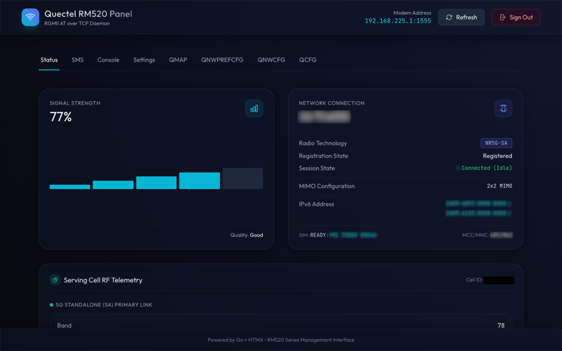
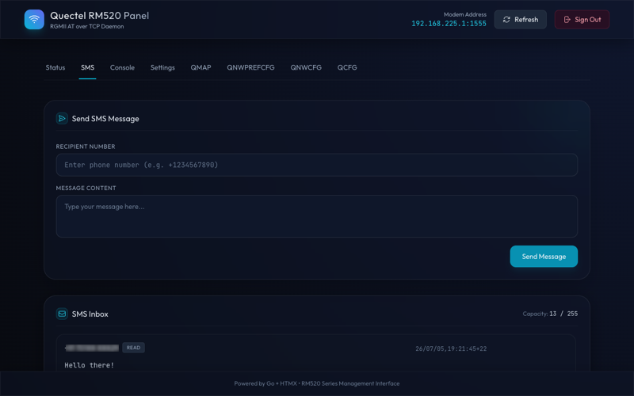
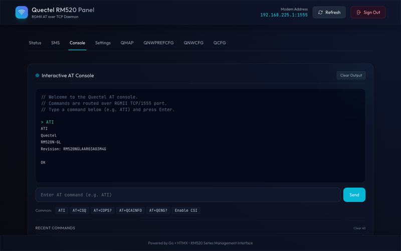
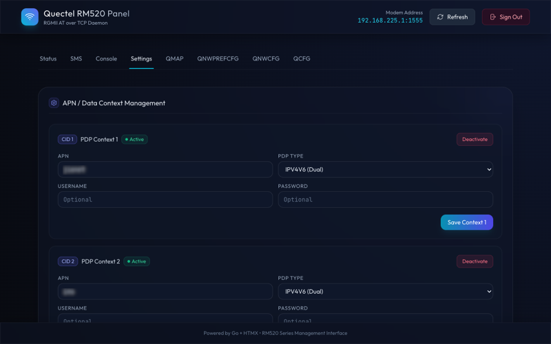
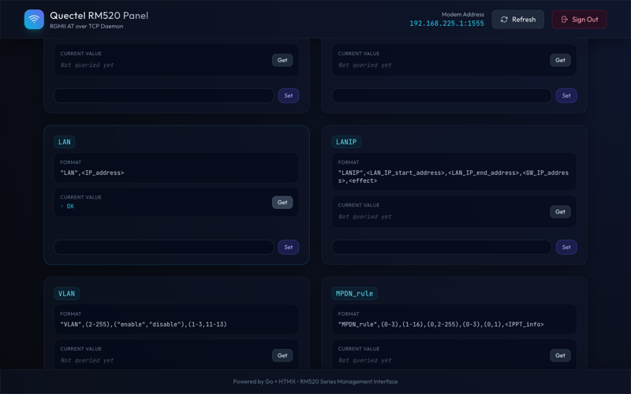
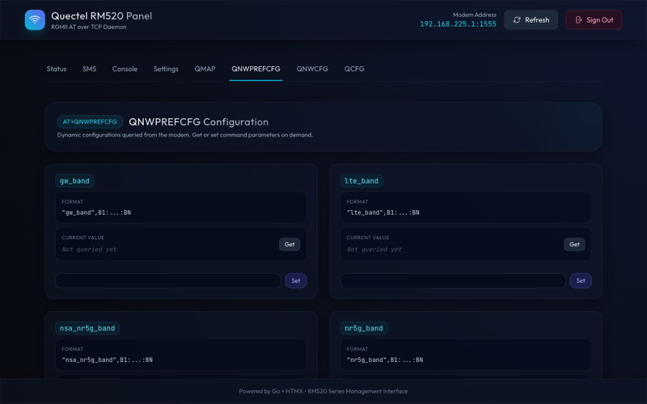
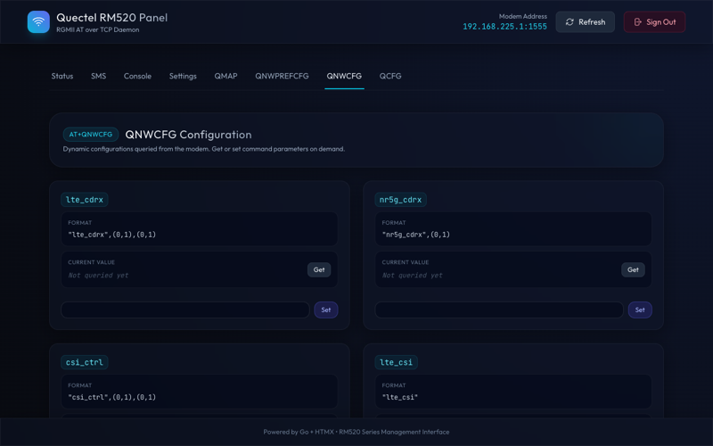
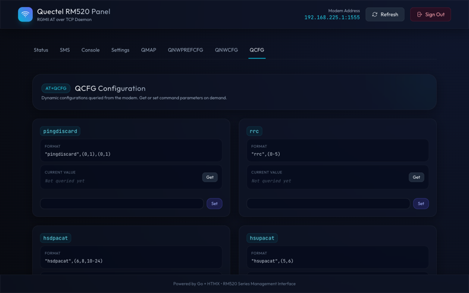

# Quectel RGMII Web Control Panel Screenshots

This document provides a detailed overview and screenshots of the features available in the Quectel RGMII Web Control Panel.

---

## 1. Status Dashboard

The main page displays comprehensive, real-time cellular telemetry and device hardware status queried directly from the Quectel modem.

Key indicators include:
- **Signal Strength**: Real-time signal strength percentage and quality assessment (e.g., Good/Excellent).
- **Network Connection**: Carrier name, radio technology (e.g., NR5G-SA), registration state, session status, and active IPv6 addresses.
- **Serving Cell RF Telemetry**: Detailed signal properties including Band, RSRP, RSRQ, SINR, PCI, and ARFCN.
- **Device Hardware Info**: Manufacturer, model name, firmware release version, session uptime, and telemetry sync timestamp.

---

## 2. SMS Manager

The SMS tab allows users to send outgoing SMS messages and manage the inbox stored on the SIM card.

Key options include:
- **Send SMS Message**: Simple form to enter a recipient phone number and text content.
- **SMS Inbox**: Displays capacity usage (e.g., `13 / 255` slots occupied), sender numbers, read status, timestamps, and message contents.
- **Action Controls**: Dedicated buttons to **Reply** or **Delete** messages from the SIM storage.

---

## 3. Interactive AT Console

The console feature provides a command-line interface to execute raw AT commands directly on the modem over the TCP interface.

Key elements:
- **Command Input**: Textbox to input custom AT commands with a **Send** button.
- **Common Helpers**: Shortcuts for frequently used commands (e.g., `ATI`, `AT+CSQ`, `AT+COPS?`, `AT+QCAINFO`, `AT+QENG?`, and `Enable CSI`).
- **Command History**: A list of recently executed commands with a clear option.

---

## 4. Settings (APN / PDP Contexts) [WIP]

The settings page offers context configuration for network access points (APNs) and data routing.

Key settings:
- **PDP Context Management**: View, activate, deactivate, or edit multiple contexts (CIDs).
- **Configuration Fields**: Set APN string, PDP Type (IPv4, IPv6, or IPV4V6 Dual), username, and password credentials.
- **Connection Status**: Real-time indication of current network context connectivity.

---

## 5. Advanced Modem Configurations (QMAP, QNWPREFCFG, QNWCFG, QCFG)

Advanced configuration interfaces query specific parameter tables from the modem and allow settings updates on demand.

### AT+QMAP Configuration
Configure WWAN parameters, DMZ, PING targets, DNS servers, GRE subnets, and local network settings (LAN, DHCP ranges, VLANs).

### AT+QNWPREFCFG Configuration
Manage network access preferences, band locking (LTE, 5G NR, NSA, NRDC), service domains, roaming preferences, and voice domains.

### AT+QNWCFG Configuration
Adjust carrier aggregation, cellular measurements, cell selection rules, and fine-tuning configurations.

### AT+QCFG Configuration
Configure low-level modem system behavior, band configurations, USB profiles, transceiver configurations, and hardware parameters.

